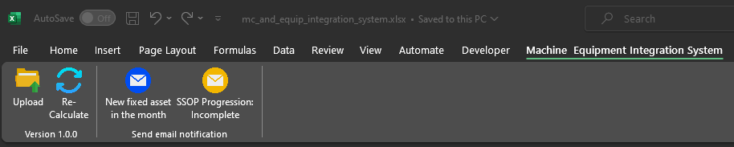

# Machine Equipment Integration System

### My Freelance Project with VSTO Development

Welcome to my freelance project! This project was initiated based on user requests, and I've chosen to implement it using VSTO (Visual Studio Tools for Office).

### VSTO Integration

Our project leverages VSTO (Visual Studio Tools for Office), a technology by Microsoft that enhances the integration of our solution with Microsoft Office applications. VSTO allows us to seamlessly extend and customize Office functionalities, providing users with a more robust and tailored experience.

**Technology Stack:** Our project utilizes VSTO alongside .NET Framework.

For more details on VSTO, refer to the official [VSTO documentation](https://learn.microsoft.com/en-us/visualstudio/vsto/office-solutions-development-overview-vsto?view=vs-2022).

Add-in Menu on Mocrosoft Excel

**Features:**

- Upload - Select a folder and copy a Worksheet to system.

  []
  
  Click [here](https://drive.google.com/file/d/1zTLiEedxNGHMkGRO6m4c78IkjpiFwcu6/view?usp=sharing) to watch the full video.

- Re-Calculate - If you're editing a worksheet. You can use this button to calculate again.

- New fixed asset in the month & SSOP Progression : Incomplete - Generate email body in Outlook based on user condition.

  []
  
  Click [here](https://drive.google.com/file/d/1i-8WqcNrVd593dw5A_73c_eU_Q0DTtOT/view?usp=sharing) to watch the full video.
